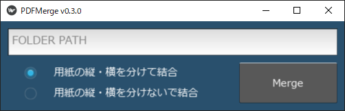

# PDF マージツール


このスクリプトは、Python を使用して PDF ファイルをマージするものです。  
指定されたディレクトリ内の PDF ファイルを結合し、用紙サイズに応じて横向きと縦向きの結合を別々に行うことができます。

## 機能

- 任意のディレクトリ内の PDF ファイルを以下の2種の方法で結合します。
  1. 用紙サイズ毎に結合を実施
  2. 用紙サイズ毎かつ横向きと縦向きの結合を別々に実施

## 依存関係

スクリプトを直接実施する場合は以下の依存ライブラリのインストールが必要です。

- Python 3
- [pypdf 4.2.0](https://github.com/py-pdf/pypdf)
- [kivy 2.3.0](https://github.com/kivy/kivy)

## 注意事項

- 対応サイズについて
  - A0 ~ A4 のA版サイズのみに対応
- スクリプト、exeファイルの保存場所について
  - 結合するPDFファイルと同一のディレクトリに保存する必要があります
- ファイル名称につて
  - 結合処理実施直前に`merged`の名称が含まれるファイルが削除されます
    - これは事前に結合していたファイルとの混同をかいひするものです
    - この挙動により`merged`が含まれるファイルを結合はできません

## 使用法

- 以下のコマンド、もしくは`merge_pdfs.exe`ファイルを実行  

```shell
python pdf_merge.py
```



- 起動した画面に結合したい PDF の保存場所のパスを入力
- 横向きと縦向きの PDF を別々に結合するかどうかを選択
- "Merge" ボタンを押す

### 用紙の縦・横を分けて結合

- 縦向きの PDF ファイルは、`merged_A0_V.pdf`、 `merged_A1_V.pdf` などという名前で結合・保存されます。
- 横向きの PDF ファイルは、`merged_A0_H.pdf`、 `merged_A1_H.pdf` などという名前で結合・保存されます。

### 用紙の縦・横を分けないで結合

- 縦、横向き関係なく PDF ファイルは、`merged_A0.pdf`、 `merged_A1.pdf` などという名前で結合・保存されます

## ライセンス

このプロジェクトは MIT ライセンスの下で利用できます。詳細については、[LICENSE](LICENSE) ファイルを参照してください。

[LICENSE]: https://github.com/mizu-99/PDFMerge/blob/master/LICENSE